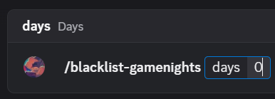

# How to Remove Users from the Blacklist from Joining Game Nights


You must be a **Host** to use this command.


<figure><figcaption></figcaption></figure>

### Step 1 – Set the days to 0

By setting the **Days** value to `0`, you will remove the user’s blacklist from joining Game Nights.

<figure><figcaption></figcaption></figure>

### Step 2 – Select the blacklisted user

Select the user you want to remove from the blacklist. If they are not currently blacklisted, this command will not work because their blacklist has already been removed, or they were never on the blacklist.

### Step 3 – Provide a reason

Enter a clear reason for removing this user from the blacklist. For example: `This user successfully appealed their blacklist.`

### Step 4 – Finalize

Send the command by pressing the Enter key, and you’re done!

Congratulations! You’ve completed the tutorial on how to remove a user from the blacklist for Game Nights.
